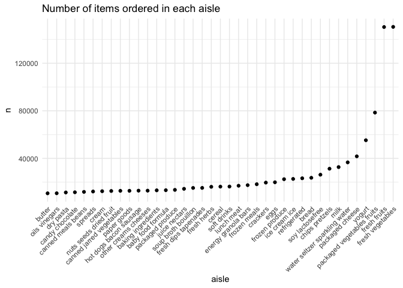
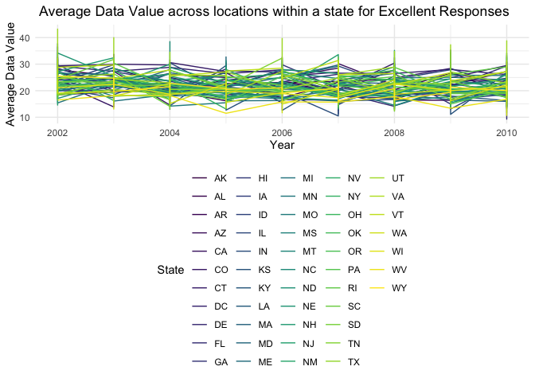
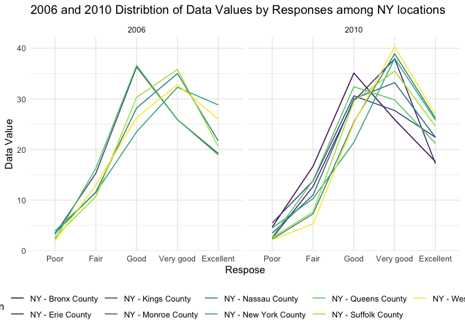
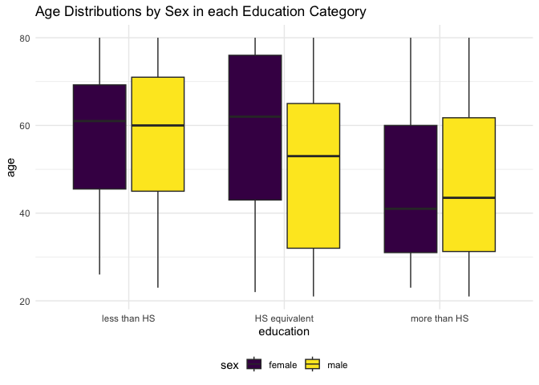
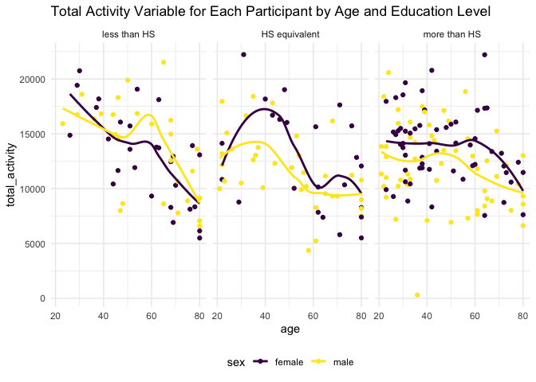
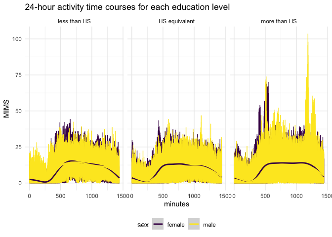

p8105 Homework 3 (UNI:gvs2113)
================
Grace Santos
2023-10-11

``` r
library(tidyverse)
```

    ## ── Attaching core tidyverse packages ──────────────────────── tidyverse 2.0.0 ──
    ## ✔ dplyr     1.1.3     ✔ readr     2.1.4
    ## ✔ forcats   1.0.0     ✔ stringr   1.5.0
    ## ✔ ggplot2   3.4.3     ✔ tibble    3.2.1
    ## ✔ lubridate 1.9.2     ✔ tidyr     1.3.0
    ## ✔ purrr     1.0.2     
    ## ── Conflicts ────────────────────────────────────────── tidyverse_conflicts() ──
    ## ✖ dplyr::filter() masks stats::filter()
    ## ✖ dplyr::lag()    masks stats::lag()
    ## ℹ Use the conflicted package (<http://conflicted.r-lib.org/>) to force all conflicts to become errors

``` r
theme_set(theme_minimal() + theme(legend.position = "bottom"))

options(
  ggplot2.continuous.colour = "viridis",
  ggplot2.continuous.fill = "viridis"
)

scale_colour_discrete = scale_colour_viridis_d
scale_fill_discrete = scale_fill_viridis_d
```

## Problem 1

This problem uses a cleaned and reduced version of a dataset entitled:
“The Instacart Online Grocery Shopping Dataset 2017” that was accessed
on June 24, 2017. As a leading online grocery service, Instacart allows
you to shop online from local grocery stores and thus provides us with a
dataset involving observations about each grocery order and its user.
More specifically, the entire 2017 dataset is an anonymized dataset with
over 3 million orders from over 200,000 users. With that, let’s see what
we can find out by using a more manageable version of the 2017 data…

``` r
library(p8105.datasets)
data("instacart")
```

At first glance, the `instacart` data set consists of 15 columns and
1384617 observations. The information provided in this data set reveals
characteristics of the buyer, their buying habits, the food order and
the food products included. There is data included for a total of 131209
orders placed using the Instacart app. Many of the variables in the
dataset hold a collection of identification numbers for the order, the
products, the customer,and the department and aisle in which the product
is found. It is notable that the all of the orders in dataset we are
using belong to the `train` evaluation set, indicated by the `eval_set`
column. There is also informative time related data associated with the
day of the week and hour of the day each order was placed. Most often,
orders were placed on the 0th day of the week at 14rd hour, which here
means Sunday at 2pm.

Now to answer the questions for the homework assignment:

How many aisles are there, and which aisles are most items ordered from?

``` r
instacart |> 
  group_by(aisle) |> 
  summarize(count = n()) |> nrow()  # total aisles 
```

    ## [1] 134

``` r
instacart |> 
  group_by(aisle) |> 
  summarize(count = n()) |> top_n(3) # most ordered from aisle 
```

    ## Selecting by count

    ## # A tibble: 3 × 2
    ##   aisle                       count
    ##   <chr>                       <int>
    ## 1 fresh fruits               150473
    ## 2 fresh vegetables           150609
    ## 3 packaged vegetables fruits  78493

Thus, there are 134 total aisles and the top 3 most ordered from aisles
are: fresh vegetables, fresh fruits and packages vegetables fruits.

Plot that shows the number of items ordered in each aisle:

``` r
instacart |> 
  group_by(aisle, department) |> 
  summarize(items = n()) |> 
  filter(items > 1000) |> 
  ggplot(aes(x = aisle, y = items)) +
  geom_point() +
  labs(title = "Number of items ordered in each aisle") +
  theme(axis.text.x = element_text(angle = 45, hjust = 1))
```

    ## `summarise()` has grouped output by 'aisle'. You can override using the
    ## `.groups` argument.

<!-- -->

A little crowded, but gets the point across. Best viewed in Zoom panel
due to number of aisles.

Table showing three most popular items in specified aisles and include
number of orders for each:

``` r
instacart |> 
  filter(aisle %in% c("baking ingredients", "dog food care", "packaged vegetables fruits")) |> 
  group_by(aisle, product_name) |> 
  summarize(items = n()) |> 
  top_n(3) |> 
  knitr::kable(digits = 1)
```

    ## `summarise()` has grouped output by 'aisle'. You can override using the
    ## `.groups` argument.
    ## Selecting by items

| aisle                      | product_name                                  | items |
|:---------------------------|:----------------------------------------------|------:|
| baking ingredients         | Cane Sugar                                    |   336 |
| baking ingredients         | Light Brown Sugar                             |   499 |
| baking ingredients         | Pure Baking Soda                              |   387 |
| dog food care              | Organix Chicken & Brown Rice Recipe           |    28 |
| dog food care              | Small Dog Biscuits                            |    26 |
| dog food care              | Snack Sticks Chicken & Rice Recipe Dog Treats |    30 |
| packaged vegetables fruits | Organic Baby Spinach                          |  9784 |
| packaged vegetables fruits | Organic Blueberries                           |  4966 |
| packaged vegetables fruits | Organic Raspberries                           |  5546 |

Table showing mean hour of the day at which Pink Lady Apples and Coffee
Ice Cream are ordered on each day of the week:

``` r
instacart |> 
  filter(product_name %in% c("Pink Lady Apples", "Coffee Ice Cream")) |> 
  group_by(product_name, order_dow) |> 
  summarize(mean_hour = mean(order_hour_of_day)) |> 
  pivot_wider(
    names_from = order_dow, 
    values_from = mean_hour
  ) |> 
  knitr::kable(digits = 1)
```

    ## `summarise()` has grouped output by 'product_name'. You can override using the
    ## `.groups` argument.

| product_name     |    0 |    1 |    2 |    3 |    4 |    5 |    6 |
|:-----------------|-----:|-----:|-----:|-----:|-----:|-----:|-----:|
| Coffee Ice Cream | 13.8 | 14.3 | 15.4 | 15.3 | 15.2 | 12.3 | 13.8 |
| Pink Lady Apples | 13.4 | 11.4 | 11.7 | 14.2 | 11.6 | 12.8 | 11.9 |

## Problem 2

``` r
library(p8105.datasets)
data("brfss_smart2010")
```

Data Cleaning:

``` r
brfss_smart2010 = 
brfss_smart2010 |> 
  janitor::clean_names() |> 
  filter( 
    topic == "Overall Health",
    response %in% c("Poor", "Fair", "Good", "Very Good", "Excellent")) |> 
  mutate(response = factor(response, levels = c("Poor", "Fair", "Good", "Very Good", "Excellent"), ordered = TRUE))
```

In 2002 which states were observed at 7 or more locations?

``` r
brfss_smart2010 |> 
  filter (year == "2002") |> 
  group_by (locationabbr) |> 
  summarize (locations = n_distinct(locationdesc)) |> 
  filter (locations >= 7) 
```

    ## # A tibble: 6 × 2
    ##   locationabbr locations
    ##   <chr>            <int>
    ## 1 CT                   7
    ## 2 FL                   7
    ## 3 MA                   8
    ## 4 NC                   7
    ## 5 NJ                   8
    ## 6 PA                  10

In 2002, there were 6 states that were observed at 7 or more locations.

In 2010?

``` r
brfss_smart2010 |> 
  filter (year == "2010") |> 
  group_by (locationabbr) |> 
  summarize (locations = n_distinct(locationdesc)) |> 
  filter (locations >= 7) 
```

    ## # A tibble: 14 × 2
    ##    locationabbr locations
    ##    <chr>            <int>
    ##  1 CA                  12
    ##  2 CO                   7
    ##  3 FL                  41
    ##  4 MA                   9
    ##  5 MD                  12
    ##  6 NC                  12
    ##  7 NE                  10
    ##  8 NJ                  19
    ##  9 NY                   9
    ## 10 OH                   8
    ## 11 PA                   7
    ## 12 SC                   7
    ## 13 TX                  16
    ## 14 WA                  10

In 2010, there were 14 states that were observed at 7 or more locations.

Construct a dataset limited to “Excellent” responses and then make a
“spaghetti” plot of average of `data_value` across locations within a
state.

``` r
  brfss_smart2010 |> 
  filter(response == "Excellent") |> 
  group_by(year, locationabbr, locationdesc) |> 
  summarize(avg_data_value = mean(data_value)) |> 
  ggplot(aes(x = year, y = avg_data_value, group = locationabbr, color = locationabbr)) + geom_line() + 
  labs (
    title = " Average Data Value across locations within a state for Excellent Responses",
    x = "Year",
    y = "Average Data Value",
    color = "State") 
```

    ## `summarise()` has grouped output by 'year', 'locationabbr'. You can override
    ## using the `.groups` argument.

<!-- -->

Make a 2-panel plot showing distribution of `data_value` for responses
among NY state locations

``` r
brfss_smart2010 |> 
  filter(locationabbr == "NY", 
         year %in% c("2006", "2010")) |> 
  ggplot(aes(x = response , y = data_value, group = locationdesc, color = locationdesc)) + geom_line() +
  facet_wrap(. ~ year) + 
  labs( 
    title = "2006 and 2010 Distribtion of Data Values by Responses among NY locations ",
    x = "Respose",
    y = "Data Value",
    color = "Location")
```

<!-- -->

## Problem 3

Load, tidy, merge and organize the datasets.

``` r
accel_data = 
  read_csv("./data/nhanes_accel.csv")
```

    ## Rows: 250 Columns: 1441
    ## ── Column specification ────────────────────────────────────────────────────────
    ## Delimiter: ","
    ## dbl (1441): SEQN, min1, min2, min3, min4, min5, min6, min7, min8, min9, min1...
    ## 
    ## ℹ Use `spec()` to retrieve the full column specification for this data.
    ## ℹ Specify the column types or set `show_col_types = FALSE` to quiet this message.

``` r
covar_data = 
  read_csv("./data/nhanes_covar.csv", skip = 4, col_names = TRUE)
```

    ## Rows: 250 Columns: 5
    ## ── Column specification ────────────────────────────────────────────────────────
    ## Delimiter: ","
    ## dbl (5): SEQN, sex, age, BMI, education
    ## 
    ## ℹ Use `spec()` to retrieve the full column specification for this data.
    ## ℹ Specify the column types or set `show_col_types = FALSE` to quiet this message.

``` r
mims_df = right_join(covar_data, accel_data, by = "SEQN")

mims_df_2 = 
  mims_df |> 
    filter(age >= "21") |> 
    drop_na() |> 
    mutate( 
      sex = case_match(
        sex,
        1 ~ "male", 
        2 ~ "female"),
      sex = as.factor(sex),
      education = case_match(
        education,
        1 ~ "less than HS",
        2 ~ "HS equivalent",
        3 ~ "more than HS"),
      education = factor(education, levels = c("less than HS","HS equivalent", "more than HS"), ordered = TRUE)
      )
```

Produce a reader-friendly table for the number of men and women in each
education category.

``` r
mims_df_2 |> 
  group_by(sex, education) |> 
  summarize(n = n()) |> 
  pivot_wider(
    names_from = education,
    values_from = n) |> 
  knitr::kable(digits = 2)
```

    ## `summarise()` has grouped output by 'sex'. You can override using the `.groups`
    ## argument.

| sex    | less than HS | HS equivalent | more than HS |
|:-------|-------------:|--------------:|-------------:|
| female |           28 |            23 |           59 |
| male   |           27 |            35 |           56 |

This table shows, that there are similar numbers in participants who
have either less than or more than high school education. There is a
much larger difference, in favor of male participants in the category of
having a high school equivalent education.

Create a visualization of age distributions for men and women in each
category.

``` r
mims_df_2 |> 
  ggplot(aes(x = education, y = age, fill = sex)) + geom_boxplot()
```

<!-- -->

From the box plots generated, you can conclude that the median ages and
overall spread of ages between males and females who have less education
than high school are very similar. The largest spread and difference in
median are between the ages of men and women who have high school
equivalent education. The one case in which the male median is higher
than the female median is for those with higher than high school
education.

Aggregate across minutes to create a total activity variable for each
participant over the whole day.

``` r
mims_df_2 |> 
  pivot_longer(
    min1:min1440,
    names_to = "total_activity",
    names_prefix = "min",
    values_to = "MIMS") |> 
  mutate(total_activity = as.numeric(total_activity)) |> 
  group_by(SEQN) |> 
  ggplot(aes(x = age, y = total_activity, color = sex)) + geom_line() + geom_smooth(aes(group = sex)) + facet_grid(. ~ education) +
  labs(
    title = "Total Activity Variable for Each Participant by Age and Education Level"
  )
```

    ## `geom_smooth()` using method = 'gam' and formula = 'y ~ s(x, bs = "cs")'

<!-- -->

Make a 3 panel plot that shows 24-hour activity time courses for each
education level and color by sex.

``` r
mims_df_2 |> 
  pivot_longer(
    min1:min1440,
    names_to = "total_activity",
    names_prefix = "min",
    values_to = "MIMS") |> 
  mutate(total_activity = as.numeric(total_activity)) |> 
  group_by(SEQN) |> 
  ggplot(aes(x = total_activity, y = MIMS, color = sex)) + geom_line() + geom_smooth(aes(group = sex)) + facet_grid(. ~ education) + 
  labs(
    title = "24-hour activity time courses for each education level"
  )
```

    ## `geom_smooth()` using method = 'gam' and formula = 'y ~ s(x, bs = "cs")'

<!-- -->
